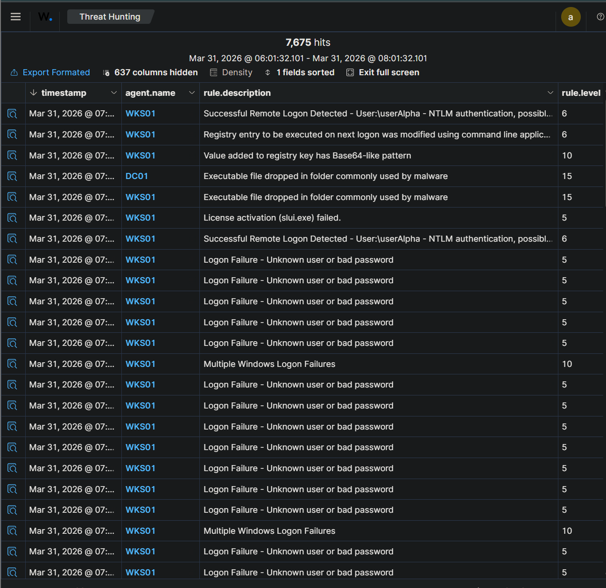
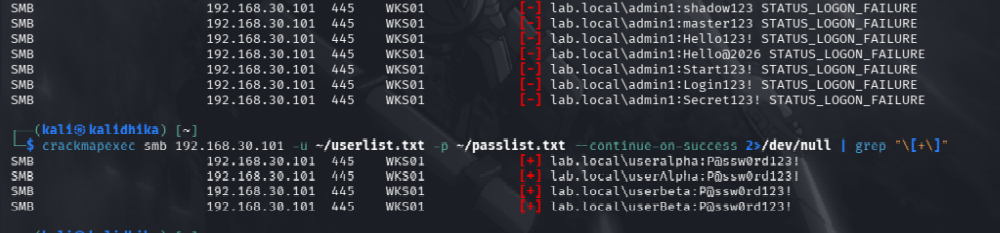
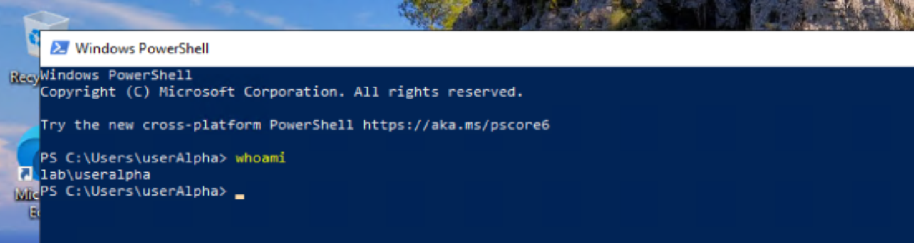

# 01 - Alert Triage

**Case:** INC-001-rdp-intrusion  
**Investigator:** Hardhika Helmi  
**Started:** [tanggal mulai investigasi]  
**Status:** Active

---

## Kenapa Case Ini Dibuka

Mulai dari Wazuh dashboard - ada spike alert yang cukup noticeable. Yang pertama nangkap mata adalah rule 60204: *Multiple Windows Logon Failures*. Volume-nya tidak normal, dan setelah saya lihat lebih dekat, sumber request-nya konsisten dari satu IP: 192.168.30.200, target WKS01 (192.168.30.101).

Awalnya saya pikir mungkin service account misconfigured, atau user yang lupa password. Tapi pola failure-nya berbeda - bukan satu akun yang gagal berkali-kali, tapi multiple akun berbeda yang dicoba dalam waktu singkat. Itu yang bikin saya lanjut.

---

## Alert Awal yang Jadi Trigger

**Rule 60122 & 60204 - Windows Logon Failures (Multiple)**

- Source IP: 192.168.30.200
- Target: WKS01 / 192.168.30.101
- Port yang terlibat: 445 (SMB)
- Pattern: banyak akun berbeda, password berbeda, window waktu sempit

Pola ini lebih mirip credential spray daripada brute force. Seseorang sedang coba-coba kombinasi credential ke SMB WKS01.

*Alert dashboard Wazuh selama campaign berlangsung - terlihat cluster logon failure diikuti logon success*

---

## Triage Awal - Seberapa Serius?

Tiga pertanyaan yang saya kejar duluan:

**1. Ada logon SUCCESS setelah failures ini?**

Ya. Rule 92657 muncul - *Successful Remote Logon* dari 192.168.30.200, akun `LAB\userAlpha`, method NTLM. Credential spray berhasil. Ini langsung naikkan prioritas case ini.

*crackmapexec konfirmasi credentials valid: userAlpha dan userBeta*

**2. userAlpha akun sensitif?**

Belum tahu di titik ini. Perlu dicek lebih lanjut. Default posture: treat as compromised sampai terbukti sebaliknya.

**3. Ada aktivitas lanjutan setelah logon berhasil?**

Rule 92653 muncul - *User logged via RDP* dari 192.168.30.200. Jadi bukan cuma autentikasi, tapi ada sesi aktif ke WKS01. Cukup untuk buka case.

*Sesi RDP aktif di WKS01 sebagai userAlpha - whoami confirm identity*

---

## Alert Lain yang Muncul di Window Waktu yang Sama

Waktu saya lagi fokus ke credential spray cluster, beberapa alert lain juga masuk:

- **67028 - Special privileges assigned to new logon** - timing berdekatan dengan logon userAlpha, saya noted tapi belum pivot ke sini
- **92307 - Service creation in registry** - muncul beberapa kali, saya lewati karena masih fokus rekonstruksi initial access. Ini jadi missed item - bahasnya nanti di 05-detection-gaps.md
- **92217 level 15 - Executable file dropped in folder commonly used by malware** - ini muncul di dua host: DC01 dan WKS01. Level 15 harusnya langsung menarik perhatian. Tapi jujur, saat itu saya sedang pivot ke lateral movement dan alert ini tenggelam di noise. Juga jadi detection gap.
- **Level 10 - Registry value with Base64-like pattern** - ini yang paling saya sesali missed. Alertnya ada, tapi waktu itu saya tidak connect ke persistence activity. Ceritanya ada di 05-detection-gaps.md.

---

## Initial Scope Assessment

Dari triage awal:

| Host | Status | Catatan |
|------|--------|---------|
| WKS01 / 192.168.30.101 | Compromised | Credential spray berhasil, sesi RDP aktif |
| DC01 / 192.168.30.100 | Unknown | Belum ada alert eksplisit ke sini di tahap ini |
| SIEM / 192.168.30.50 | Tidak terdampak | Tidak ada indikasi |

**Hipotesis awal:**
Attacker dari 192.168.30.200 berhasil credential spray ke WKS01 via SMB, dapat `userAlpha`, masuk via RDP. Belum diketahui apakah mereka lateral movement ke sistem lain atau stuck di WKS01.

**Langkah selanjutnya:** pivot ke 02-investigation.md - rekonstruksi aktivitas userAlpha post-logon, cek koneksi outbound dari WKS01, lihat apakah ada trail ke DC01.

---

*Timeline kronologi lengkap ada di 03-timeline.md. Document ini fokus ke proses triage dan decision point awal.*
