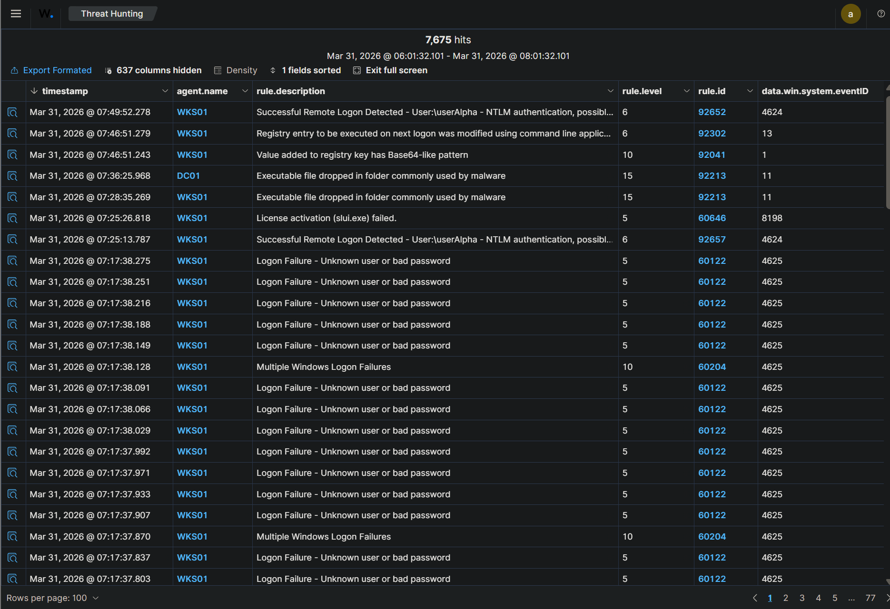
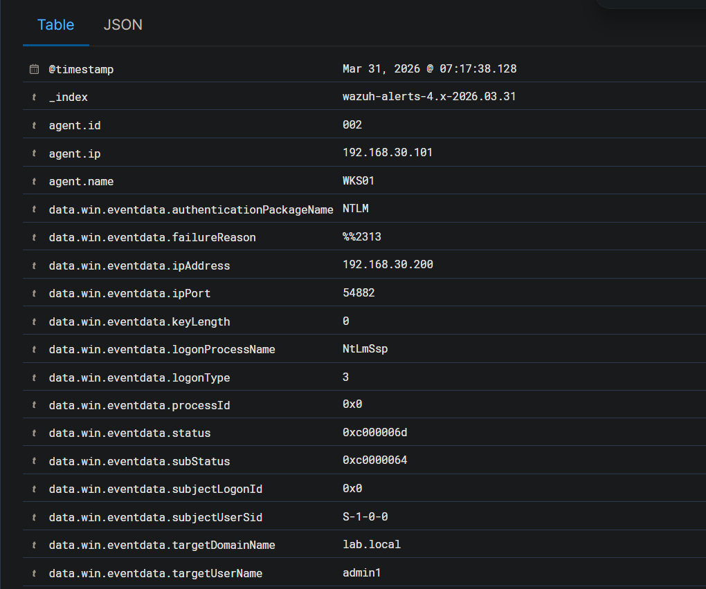
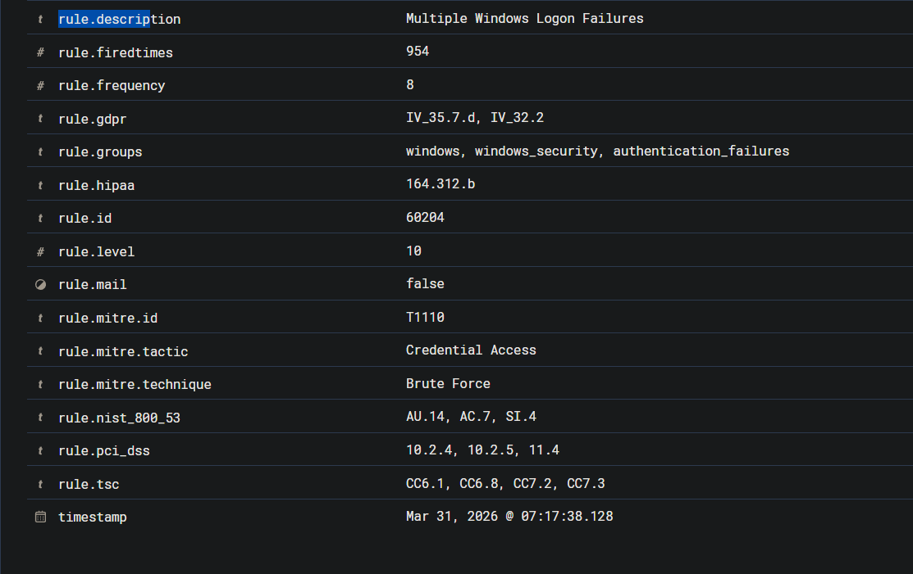
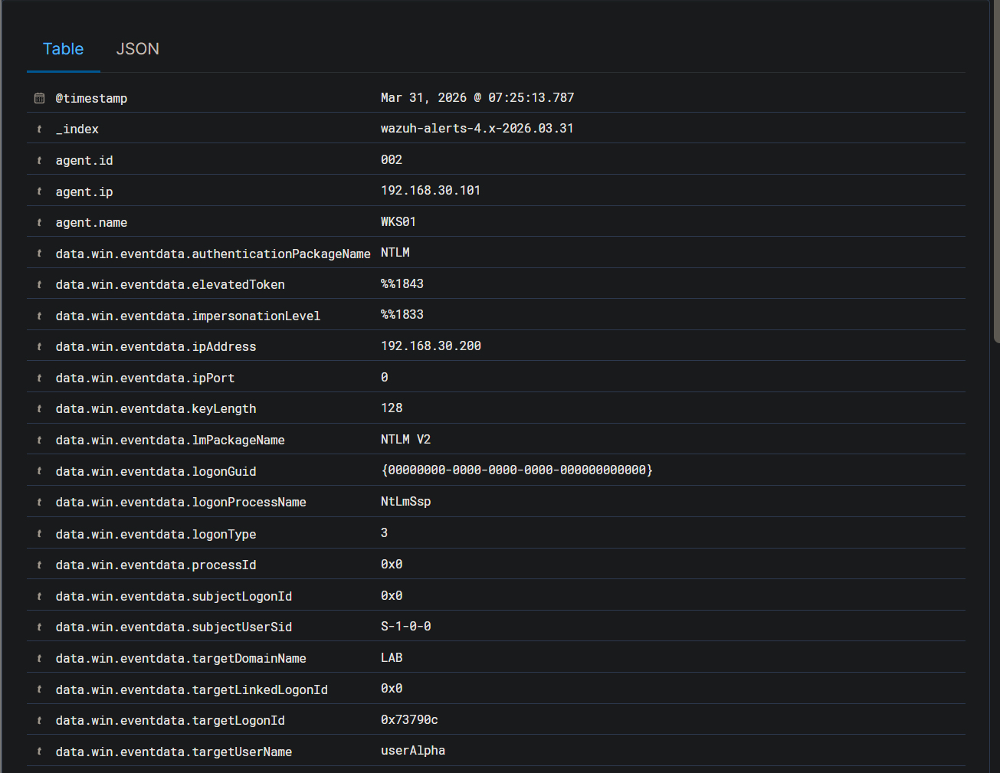
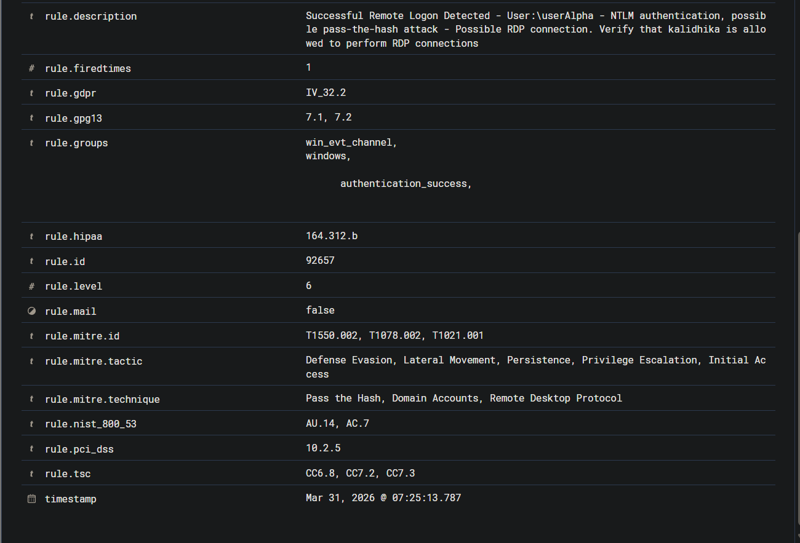

# 01 - Alert Triage

**Case:** INC-001-rdp-intrusion  
**Investigator:** Hardhika Helmi  
**Started:** Mar 31, 2026 @ 07:17 (berdasarkan timestamp alert pertama)  
**Status:** Active

---

## Kenapa Case Ini Dibuka

Mulai dari Wazuh dashboard - ada spike alert yang cukup noticeable. Yang pertama nangkap mata adalah rule 60204: *Multiple Windows Logon Failures*. Volume-nya tidak normal, dan setelah saya lihat lebih dekat, sumber request-nya konsisten dari satu IP: 192.168.30.200, target WKS01 (192.168.30.101).

Awalnya saya pikir mungkin service account misconfigured, atau user yang lupa password. Tapi dari detail alert, pola failure-nya lebih kompleks dari itu.

---

## Alert Awal yang Jadi Trigger

**Rule 60122 & 60204 - Windows Logon Failures (Multiple)**

*Alert list Wazuh - cluster 60122 logon failure jam 07:17, diikuti 92657 logon success jam 07:25*

*Detail 60204 - source IP 192.168.30.200, targetUserName admin1, NTLM, domain lab.local*

*Rule detail - firedtimes 954, MITRE T1110 Credential Access*

Dari detail alert ini, ada beberapa hal yang saya perhatikan:

- `data.win.eventdata.ipAddress`: 192.168.30.200 - sumber konsisten, satu IP
- `data.win.eventdata.targetUserName`: admin1 - ini *salah satu* akun yang dicoba, bukan satu-satunya
- `rule.firedtimes`: 954 - rule ini fired 954 kali dalam window waktu yang singkat

Yang menarik adalah `targetUserName` di cluster alert ini tidak konsisten - di beberapa alert saya lihat `admin1`, di yang lain `userAlpha`, di yang lain lagi `userBeta`. Bukan satu akun yang dicoba berkali-kali.

**Ini yang membedakan password spray dari brute force:**

Brute force klasik menyerang satu akun dengan banyak password berbeda - risikonya account lockout kalau policy-nya ketat. Password spray membalik pendekatan itu: banyak akun target, tapi hanya dicoba sedikit password per akun. Lebih lambat, tapi jauh lebih susah trigger lockout.

Pattern di sini jelas spray: banyak akun berbeda dicoba dari satu IP dalam window waktu sempit (semua cluster jam 07:17:3x), dengan password yang kemungkinan sama atau variasinya sedikit. Attacker punya wordlist username dan mencoba kombinasi password umum ke semua akun itu sekaligus.

---

## Triage Awal - Seberapa Serius?

Tiga pertanyaan yang saya kejar duluan:

**1. Ada logon SUCCESS setelah failures ini?**

Ya. Rule 92657 muncul - *Successful Remote Logon* dari 192.168.30.200, akun `LAB\userAlpha`, method NTLM. Spray berhasil. Ini langsung naikkan prioritas case ini.

*Alert 92657 - ipAddress 192.168.30.200, targetUserName userAlpha, workstationName kalidhika, NTLM*

*Rule detail - MITRE T1078.002 Domain Accounts, Initial Access*

Dari detail ini juga terlihat `workstationName: kalidhika` - ini hostname mesin attacker, bukan workstation corporate yang legitimate.

**2. userAlpha akun sensitif?**

Belum tahu di titik ini. Perlu dicek lebih lanjut. Default posture: treat as compromised sampai terbukti sebaliknya.

**3. Ada aktivitas lanjutan setelah logon berhasil?**

Rule 92653 muncul - *User logged via RDP* dari 192.168.30.200. Jadi bukan cuma autentikasi, ada sesi aktif ke WKS01. Cukup untuk buka case.

---

## Alert Lain yang Muncul di Window Waktu yang Sama

Waktu saya sedang fokus ke credential spray cluster, beberapa alert lain juga masuk:

- **67028 - Special privileges assigned to new logon** - timing berdekatan dengan logon userAlpha, saya noted tapi belum pivot ke sini
- **92307 - Service creation in registry** - muncul beberapa kali, saya lewati karena masih fokus rekonstruksi initial access. Ini jadi missed item - bahasnya nanti di 05-detection-gaps.md
- **92213 level 15 - Executable file dropped in folder commonly used by malware** - muncul di dua host: DC01 dan WKS01. Level 15 harusnya langsung menarik perhatian. Tapi saat itu saya sedang fokus ke lateral movement dan alert ini tenggelam di noise. Juga jadi detection gap.
- **Level 10 - Registry value with Base64-like pattern** - ini yang paling saya sesali missed. Alertnya ada, tapi waktu itu saya tidak connect ke persistence activity. Ceritanya ada di 05-detection-gaps.md.

---

## Initial Scope Assessment

Dari triage awal:

| Host | Status | Catatan |
|------|--------|---------|
| WKS01 / 192.168.30.101 | Compromised | Spray berhasil, sesi RDP aktif |
| DC01 / 192.168.30.100 | Unknown | Belum ada alert eksplisit ke sini di tahap ini |
| SIEM / 192.168.30.50 | Tidak terdampak | Tidak ada indikasi |

**Hipotesis awal:**
Attacker dari 192.168.30.200 (hostname: kalidhika) berhasil password spray ke WKS01 via SMB, dapat `userAlpha`, masuk via RDP. Belum diketahui apakah ada lateral movement ke sistem lain atau mereka stuck di WKS01.

**Langkah selanjutnya:** pivot ke 02-investigation.md - rekonstruksi aktivitas userAlpha post-logon, cek koneksi outbound dari WKS01, lihat apakah ada trail ke DC01.

---

*Timeline kronologi lengkap ada di 03-timeline.md. Document ini fokus ke proses triage dan decision point awal.*
