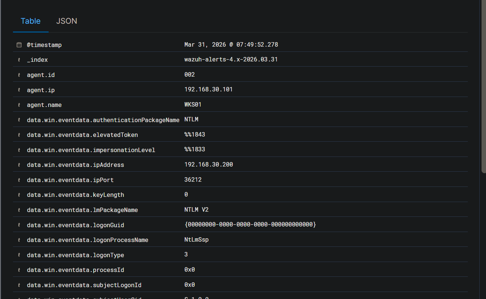
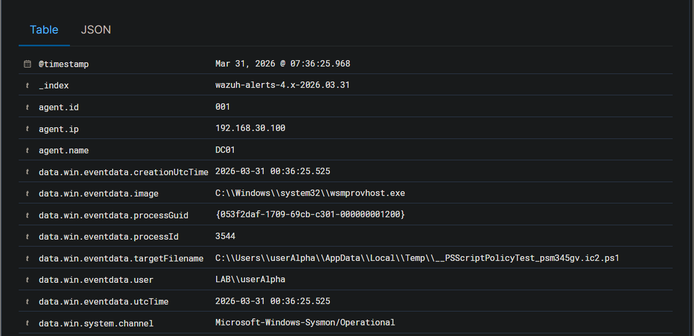
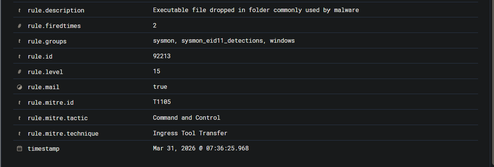
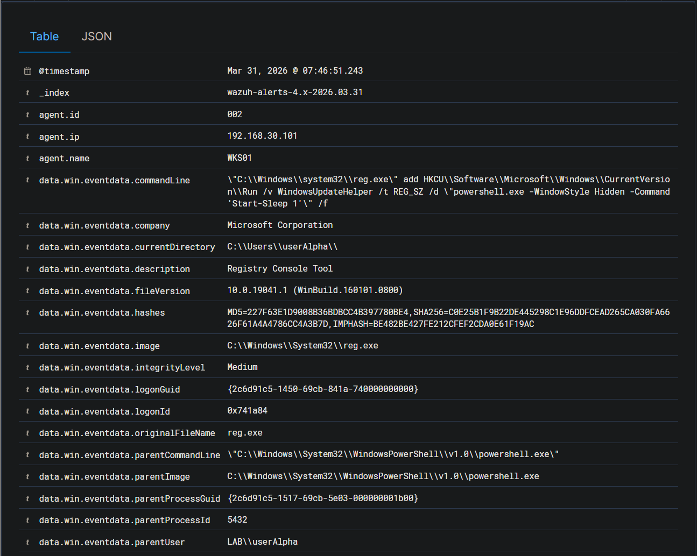
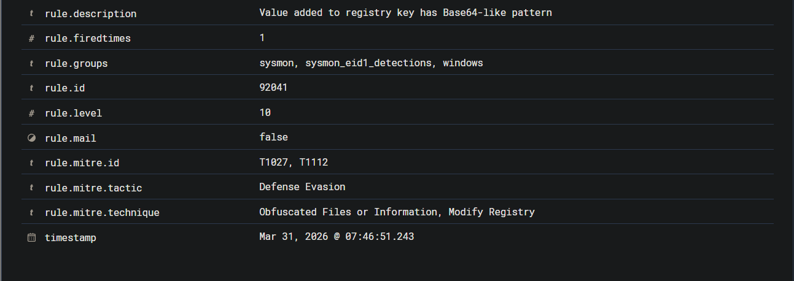
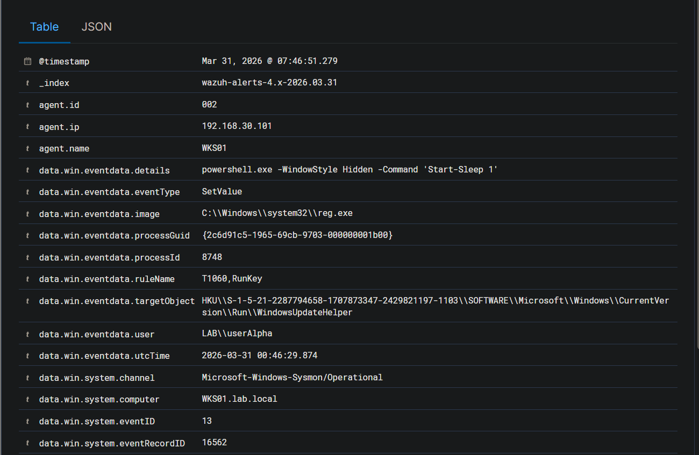
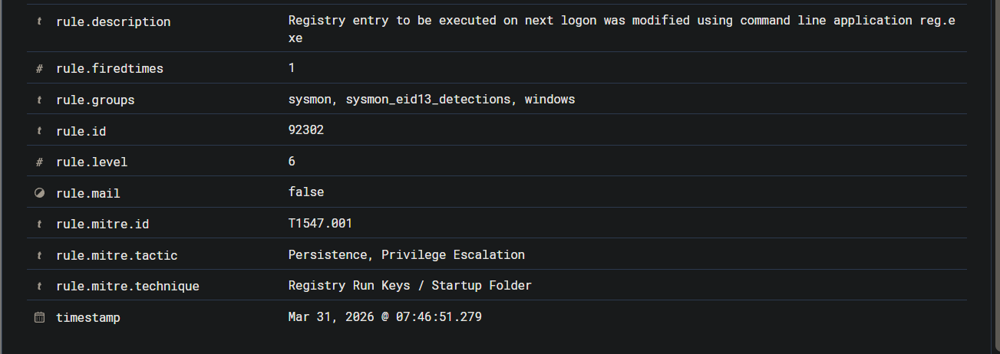
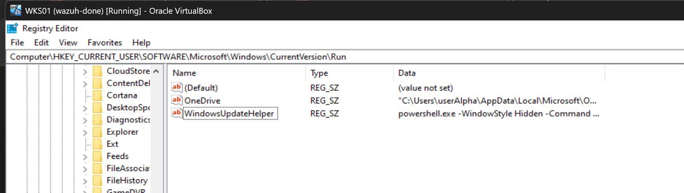
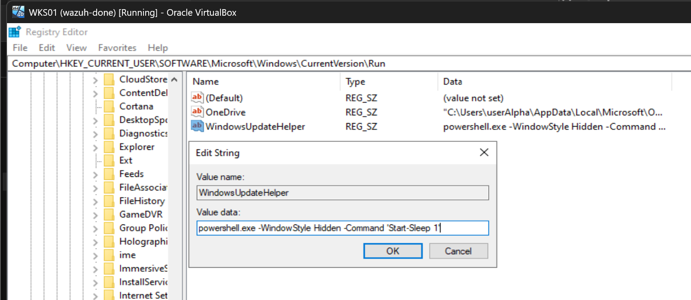

# 02 - Investigation

**Case:** INC-001-rdp-intrusion  
**Investigator:** Hardhika Helmi  
**Status:** Active

---

## Starting Point

Dari triage: password spray dari 192.168.30.200 berhasil, userAlpha masuk ke WKS01 via RDP. Pertanyaan sekarang - apa yang mereka lakukan setelah masuk?

Pivot pertama: cari aktivitas userAlpha di WKS01 setelah timestamp logon success (07:25:13).

---

## Rekonstruksi Aktivitas di WKS01

### Logon Confirmed

Alert 92657 jam 07:25:13 confirm logon success dari 192.168.30.200 ke WKS01 sebagai `LAB\userAlpha`, method NTLM. Alert 92653 muncul bersamaan - user logged via RDP. Ini bukan pass-the-hash, attacker punya plaintext credential dari spray tadi.

Saat ini saya masih asumsi userAlpha adalah standard domain user. Perlu dicek apakah dia punya local admin di WKS01.

### Cek Privilege userAlpha

Dari Wazuh - alert 67028 (special privileges assigned) muncul di sekitar waktu yang sama. Ini saya cek dulu - tapi ternyata 67028 adalah behavior normal untuk tipe logon tertentu, bukan necessarily privilege escalation. Tidak ada alert yang menunjukkan escalation attempt eksplisit seperti penggunaan `net localgroup administrators`.

**Kesimpulan sementara:** userAlpha kemungkinan standard user, tidak ada eskalasi privilege di WKS01. Tapi masih perlu cek aktivitas lanjutan.

### Aktivitas Command Prompt

Alert 92052 muncul - *Windows command prompt started by abnormal process*. Artinya ada cmd.exe atau powershell.exe yang dijalankan dari parent process yang tidak lazim dalam konteks sesi userAlpha. Dari sini saya mulai curiga ada reconnaissance yang berjalan. Tapi detail command-nya tidak langsung kelihatan dari alert ini saja.

---

## Dead End Pertama - Recon Activity di WKS01

Saya coba cari Sysmon Event ID 1 (process creation) yang terkait userAlpha di WKS01 sekitar timeframe logon. Hasilnya tidak banyak yang conclusive dari WKS01 side - tidak ada command enumeration yang significant terekam di sini.

Kemungkinan dua hal: mereka langsung cari jalan ke sistem lain, atau aktivitas mereka di WKS01 tidak generate alert yang cukup spesifik untuk di-pivot. Saya putuskan cek arah lain: apakah ada koneksi outbound dari WKS01 ke sistem lain setelah logon userAlpha.

---

## Pivot ke Lateral Movement

### Trail ke DC01

Alert 92657 muncul lagi - tapi kali ini berbeda. *Successful Remote Logon* dengan NTLM, user yang sama (`LAB\userAlpha`), timestamp 07:49, dan yang ini terekam di konteks koneksi baru dari 192.168.30.200. Ada juga alert 92652 yang muncul bersamaan.

Ini konfirmasi ada sesi baru yang dibuka setelah initial RDP. Dari port yang terlibat dan alert 92052 yang muncul di DC01 - *command prompt started by abnormal process* - saya pivot ke DC01.

**Port yang digunakan:** 5985 (WinRM). Attacker tidak coba RDP ke DC01, langsung WinRM. Ini menunjukkan mereka sudah tahu atau asumsi WinRM aktif di DC01 - kemungkinan informasi ini dari recon nmap di awal.

### Akses DC01 Confirmed

Alert 92052 muncul di DC01 - *command prompt started by abnormal process*. Ini lebih serius dari yang sama di WKS01 tadi karena ini di domain controller.

*Alert 92652 - Successful Remote Logon dari 192.168.30.200, NTLM, jam 07:49 - sesi aktif ke DC01*

Di titik ini saya konfirmasi: ada interactive session aktif di DC01 sebagai `LAB\userAlpha`.

### Apa yang Dilakukan di DC01?

Ini yang perlu saya jelaskan sumber evidence-nya.

Dari Sysmon Event ID 1 (process creation) di DC01, saya lihat net.exe dieksekusi beberapa kali dalam konteks sesi userAlpha. Parent process-nya adalah `wsmprovhost.exe` - ini adalah WinRM host process, confirm bahwa execution ini dari dalam WinRM session. Kombinasi parent-child process ini yang jadi dasar rekonstruksi command.

Command yang terekam dari Sysmon process creation DC01:
- `net group "Domain Admins" /domain` - enumerasi member Domain Admins
- `net user /domain` - list semua domain user

Untuk `whoami` dan `hostname`, ini rekonstruksi dari konteks - typical first commands dalam WinRM session baru, dan muncul di Sysmon tapi tidak generate alert Wazuh yang spesifik karena bukan process yang suspicious.

Hasilnya bisa saya rekonstruksi dari attacker-logs yang ada sebagai corroboration: Domain Admins cuma Administrator, domain users: Administrator, Guest, krbtgt, userAlpha, userBeta. userAlpha tidak ada di Domain Admins.

**Ini penting:** attacker punya shell di DC01, tapi privilege-nya terbatas. Mereka tidak bisa dump credentials, tidak bisa modify domain objects.

---

## Cek Credential Access Attempt

Alert 92213 level 15 - *Executable file dropped in folder commonly used by malware* - muncul di DC01 jam 07:36:25, sebelum lateral movement yang saya track tadi.

*Alert 92213 level 15 - targetFilename PSScriptPolicyTest di DC01, image wsmprovhost.exe, user LAB\userAlpha*

*Level 15, MITRE T1105 Ingress Tool Transfer - ini yang harusnya saya pivot lebih awal*

Dari detail alert: `targetFilename` adalah `__PSScriptPolicyTest_psm345gv.ic2.ps1` di folder Temp userAlpha, dan `image`-nya `wsmprovhost.exe`. Ini bukan malware beneran - ini artifact yang dibuat otomatis oleh WinRM/evil-winrm saat establish connection untuk test PowerShell script policy. Tapi alertnya tetap level 15 karena file .ps1 dropped ke folder Temp oleh process yang tidak lazim.

Dari hasil investigasi keseluruhan: tidak ada credential dump yang berhasil. Tidak ada alert terkait LSASS access atau Ntds.dit copy. Attacker kemungkinan coba secretsdump tapi gagal karena userAlpha bukan admin di DC01.

---

## Persistence - Yang Saya Temukan Belakangan

Saat saya sedang rekonstruksi aktivitas di WKS01, saya akhirnya lihat alert yang sebelumnya saya lewati:

**Alert 92302 level 6 - Registry entry to be executed on next logon was modified**  
**Alert 92041 level 10 - Value added to registry key has Base64-like pattern**

Keduanya timestamp 07:46:51, host WKS01, user context userAlpha.

*Alert 92041 - commandLine: reg.exe add HKCU\...\Run\WindowsUpdateHelper, parentImage: powershell.exe, parentUser: LAB\userAlpha*

*Rule detail - MITRE T1027 Obfuscated Files, T1112 Modify Registry, Defense Evasion*

*Alert 92302 - details: powershell.exe -WindowStyle Hidden, targetObject: HKCU\...\Run\WindowsUpdateHelper, ruleName: T1060,RunKey*

*Rule detail - MITRE T1547.001 Registry Run Keys, Persistence*

Dari alert 92041, `commandLine`-nya sangat eksplisit: `reg.exe add HKCU\Software\Microsoft\Windows\CurrentVersion\Run /v WindowsUpdateHelper /t REG_SZ /d "powershell.exe -WindowStyle Hidden -Command 'Start-Sleep 1'" /f`. Tidak perlu interpretasi - ini langsung ketahuan persistence mechanism-nya.

Konfirmasi langsung di host:

*Regedit WKS01 login sebagai userAlpha - WindowsUpdateHelper kelihatan di HKCU\...\Run*

*Full payload: powershell.exe -WindowStyle Hidden -Command 'Start-Sleep 1' - entry masih aktif*

Persistence ini tidak butuh admin privilege karena HKCU (per-user). Entry akan execute setiap kali userAlpha logon ke WKS01.

---

## Rekonstruksi Lengkap

Dari semua evidence yang terkumpul:

1. Password spray dari 192.168.30.200 ke WKS01 via SMB (07:17) → berhasil dapat `userAlpha`
2. Masuk WKS01 via RDP menggunakan credential userAlpha (07:25)
3. Pasang persistence di HKCU Run key - `WindowsUpdateHelper` (07:46)
4. Lateral movement ke DC01 via WinRM (07:49)
5. Domain recon di DC01 - enumerate Domain Admins dan user list
6. Credential access attempt di DC01 → gagal, userAlpha bukan admin
7. Attacker stuck, tidak ada aktivitas eskalasi lebih lanjut yang terdeteksi

**Status akhir:** persistence aktif di WKS01, credentials userAlpha dan userBeta compromised, tapi Domain Admins tidak terdampak.

---

## Yang Masih Belum Jelas

- Apakah ada aktivitas lain di WKS01 yang tidak terdeteksi (living off the land)
- Apakah userBeta juga digunakan atau hanya userAlpha
- Tool spesifik yang digunakan untuk credential access attempt di DC01

Ini saya catat sebagai investigative gaps, bukan necessarily detection failures.

---

*MITRE mapping detail ada di 04-mitre-mapping.md. Detection gaps dan missed alerts dibahas di 05-detection-gaps.md.*
