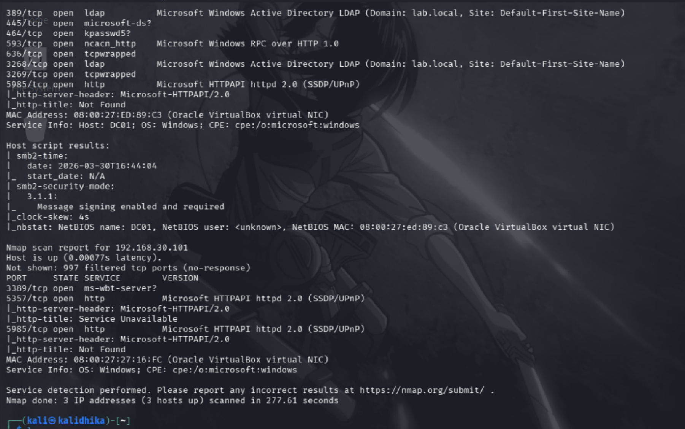
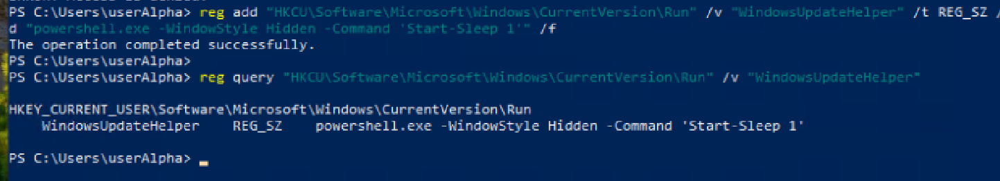
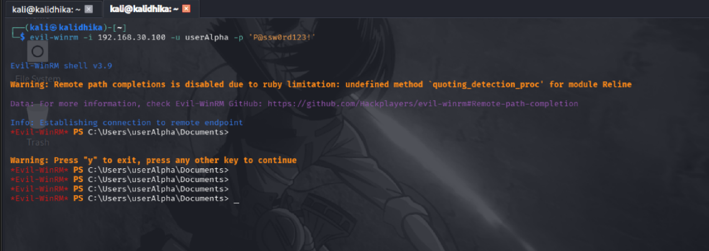
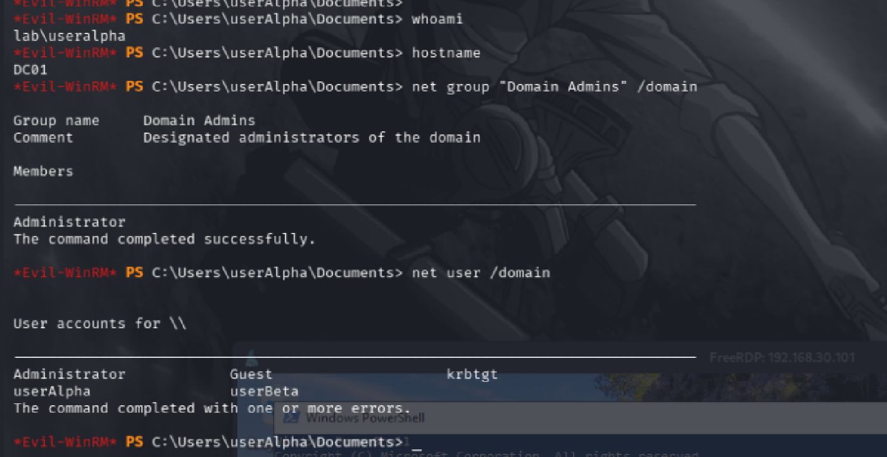

# 03 - Timeline

**Case:** INC-001-rdp-intrusion  
**Investigator:** Hardhika Helmi  
**Disusun dari:** Wazuh alerts, Sysmon logs, Windows Event Log

---

## Catatan

Timeline ini direkonstruksi dari alert dan log yang tersedia. Beberapa timestamp saya tulis sebagai [T+X min] karena exact time dari lab run tidak dicatat per-event - yang penting adalah urutan dan relasi antar event, bukan timestamp absolut.

---

## Kronologi Event

### Fase 0 - Pra-Campaign (Baseline)

**[T-0] State awal lab:**
- WKS01 online, domain-joined, user accounts aktif (userAlpha, userBeta)
- SMB port 445 aktif di WKS01 setelah firewall rule di-enable
- WinRM aktif di DC01, userAlpha sudah ditambahkan ke Remote Management Users
- Wazuh agent berjalan di WKS01 dan DC01
- Sysmon deployed di kedua host
- PowerShell logging aktif

Semua monitoring sudah ada sebelum attacker mulai. Tidak ada config change di tengah campaign.

---

### Fase 1 - Reconnaissance

**[T+1] Network Discovery - Ping Sweep**
- Source: 192.168.30.200 (Kali)
- Activity: ICMP sweep ke 192.168.30.0/24
- Host discovered: .50 (SIEM), .100 (DC01), .101 (WKS01)
- Alert Wazuh: tidak ada alert spesifik untuk ping sweep (detection gap)

**[T+2] Port Scan - Service Discovery**
- Source: 192.168.30.200
- Targets: .50, .100, .101
- Temuan penting:
  - WKS01: port 3389 (RDP) OPEN, port 445 (SMB) OPEN
  - DC01: port 5985 (WinRM) OPEN
  - SIEM: port 22 (SSH) OPEN
- Domain lab.local confirmed dari scan hasil
- Alert Wazuh: tidak ada alert spesifik untuk port scan (detection gap)


*Hasil nmap - informasi ini yang guide attack path selanjutnya*

---

### Fase 2 - Initial Access

**[T+5] Credential Spray via SMB**
- Source: 192.168.30.200
- Target: WKS01 / 192.168.30.101 port 445
- Tool: crackmapexec SMB
- Pattern: multiple username/password combinations
- **Alert: Rule 60122 - Logon Failure (multiple)**
- **Alert: Rule 60204 - Multiple Windows Logon Failures** ← trigger triage

**[T+6] Credential Spray Berhasil**
- Credentials valid ditemukan: `userAlpha:P@ssw0rd123!`, `userBeta:P@ssw0rd123!`
- **Alert: Rule 92657 level 6 - Successful Remote Logon (NTLM) dari 192.168.30.200**


*crackmapexec konfirmasi [+] credentials valid untuk userAlpha dan userBeta*

**[T+8] RDP Session Established ke WKS01**
- Source: 192.168.30.200
- Logon sebagai: `LAB\userAlpha`
- Method: RDP (port 3389)
- **Alert: Rule 92653 level 3 - User LAB\userAlpha logged via RDP from 192.168.30.200**
- **Alert: Rule 67028 - Special privileges assigned to new logon**


*Desktop WKS01 - whoami confirm sesi aktif sebagai lab\useralpha*

---

### Fase 3 - Persistence (di WKS01)

**[T+10] Registry Run Key Dipasang**
- Host: WKS01
- User context: userAlpha (HKCU - tidak butuh admin)
- Path: `HKCU\Software\Microsoft\Windows\CurrentVersion\Run`
- Value name: `WindowsUpdateHelper`
- Value data: `powershell.exe -WindowStyle Hidden -Command 'Start-Sleep 1'`
- **Alert: Rule 92307 level 3 - Service creation in registry** ← missed saat triage
- **Alert: Level 6 - Registry entry to be executed on next logon was modified** ← missed saat triage
- **Alert: Level 10 - Value added to registry key has Base64-like pattern** ← missed saat triage


*WindowsUpdateHelper entry terkonfirmasi di registry - persistence aktif*

---

### Fase 4 - Lateral Movement

**[T+15] WinRM Connection ke DC01**
- Source: WKS01 (diinisiasi dari sesi userAlpha)
- Target: DC01 / 192.168.30.100 port 5985
- Credential: `userAlpha:P@ssw0rd123!` (credential yang sama)
- **Alert: Rule 92657 level 6 - Successful Remote Logon (NTLM) ke DC01**
- **Alert: Rule 92052 level 4 - Windows command prompt started by abnormal process (DC01)**


*evil-winrm shell di DC01 - lateral movement berhasil dengan credential yang sama*

**[T+16] Executable File Dropped di DC01**
- **Alert: Rule 92217 level 15 - Executable file dropped in folder commonly used by malware (DC01)** ← missed saat triage
- Kemungkinan terkait tool credential dumping

---

### Fase 5 - Domain Reconnaissance (di DC01)

**[T+17] Domain Enumeration**
- Host: DC01, user context: `LAB\userAlpha`
- Commands dijalankan (rekonstruksi dari Sysmon):
  - `whoami` → output: `lab\useralpha`
  - `hostname` → output: `DC01`
  - `net group "Domain Admins" /domain` → Domain Admins: hanya Administrator
  - `net user /domain` → users: Administrator, Guest, krbtgt, userAlpha, userBeta


*Output domain recon - userAlpha bukan Domain Admin, path eskalasi tertutup*

**Temuan attacker:** userAlpha bukan Domain Admin, tidak ada akun lain yang bisa di-compromise dengan credential yang dimiliki.

---

### Fase 6 - Credential Access Attempt (Gagal)

**[T+20] Secretsdump Attempt**
- Tool: impacket-secretsdump (kemungkinan)
- Target: DC01
- Result: Access Denied - userAlpha bukan local admin di DC01
- Tidak ada alert credential dump yang successful

**[T+22] Cmdkey Enumeration**
- `cmdkey /list` di WKS01 atau DC01
- Result: hanya Microsoft Account SSO tokens, tidak ada credential berguna

**Attacker stuck.** Tidak ada path eskalasi privilege yang tersedia dengan access level saat ini.

---

### Fase 7 - Executable Dropped di WKS01

**[Sekitar T+20-25] Alert di WKS01**
- **Alert: Rule 92217 level 15 - Executable file dropped in folder commonly used by malware (WKS01)**
- Kemungkinan terkait tool yang sama atau artifact dari sesi RDP

---

### End State

**[T+25] Attacker tidak ada aktivitas lanjutan yang terdeteksi**

State akhir setelah campaign:
- WKS01: persistence aktif via registry Run key (HKCU\...\WindowsUpdateHelper)
- Credentials userAlpha dan userBeta: compromised (diketahui attacker)
- DC01: tidak ada persistent access, tidak ada credential yang berhasil di-dump
- Domain Administrator: tidak terdampak

---

## Summary Visual

```
T+1   [RECON]     Ping sweep → host discovery
T+2   [RECON]     Port scan → WKS01:445,3389 | DC01:5985
T+5   [ACCESS]    Credential spray SMB → multiple failures (ALERT)
T+6   [ACCESS]    Spray berhasil → userAlpha, userBeta compromised (ALERT)
T+8   [ACCESS]    RDP session aktif di WKS01 sebagai userAlpha (ALERT)
T+10  [PERSIST]   Registry Run key dipasang di WKS01 HKCU (ALERT - missed)
T+15  [LATERAL]   WinRM ke DC01 menggunakan credential yang sama (ALERT)
T+17  [RECON]     Domain enumeration di DC01 - Domain Admins, user list
T+20  [CRED]      Secretsdump attempt → GAGAL (access denied)
T+25  [END]       Attacker stuck, tidak ada eskalasi lebih lanjut
```

---

*Untuk mapping ke MITRE ATT&CK, lihat 04-mitre-mapping.md.*
