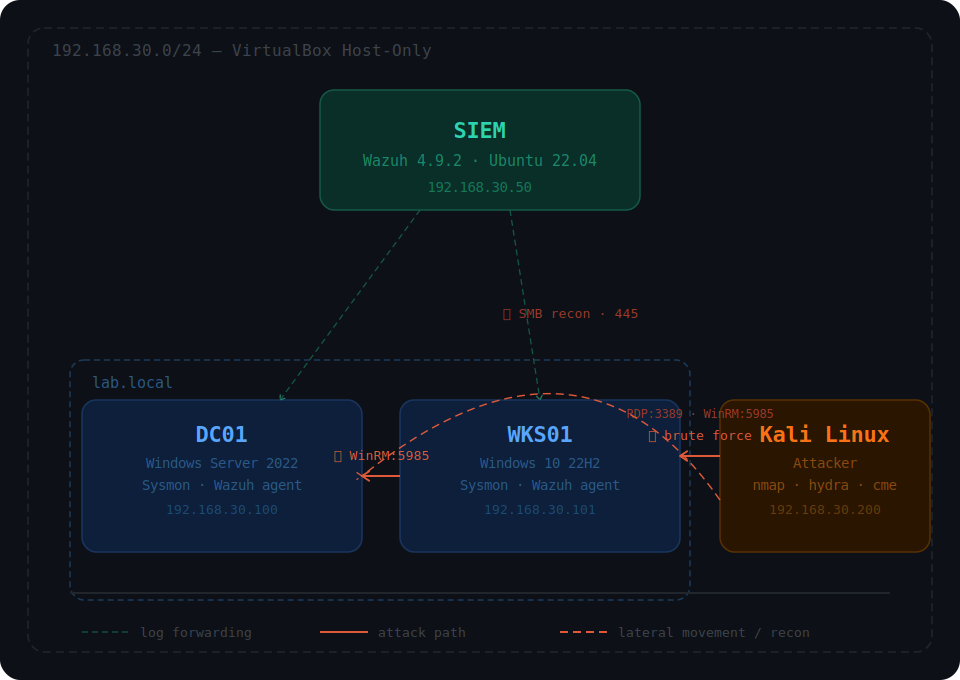

# Lab Setup - INC-001

## Topology

  

## Hosts

| Host | IP | OS | Role |
|------|----|----|------|
| SIEM | 192.168.30.50 | Ubuntu 22.04 | Wazuh 4.9.2 All-in-One |
| DC01 | 192.168.30.100 | Windows Server 2022 | Domain Controller |
| WKS01 | 192.168.30.101 | Windows 10 22H2 | Workstation |
| Kali | 192.168.30.200 | Kali Linux | Attacker |

## Domain

- Domain: `lab.local`
- Users: `userAlpha`, `userBeta`

## Monitoring Stack

- Wazuh agent di DC01 dan WKS01
- Sysmon di DC01 dan WKS01
- PowerShell ScriptBlock Logging enabled (registry manual, bukan GPO)
- Windows Security, Sysmon, PowerShell Operational logs forwarded ke SIEM

## Attacker Tools

- nmap
- hydra
- evil-winrm
- crackmapexec
- impacket
