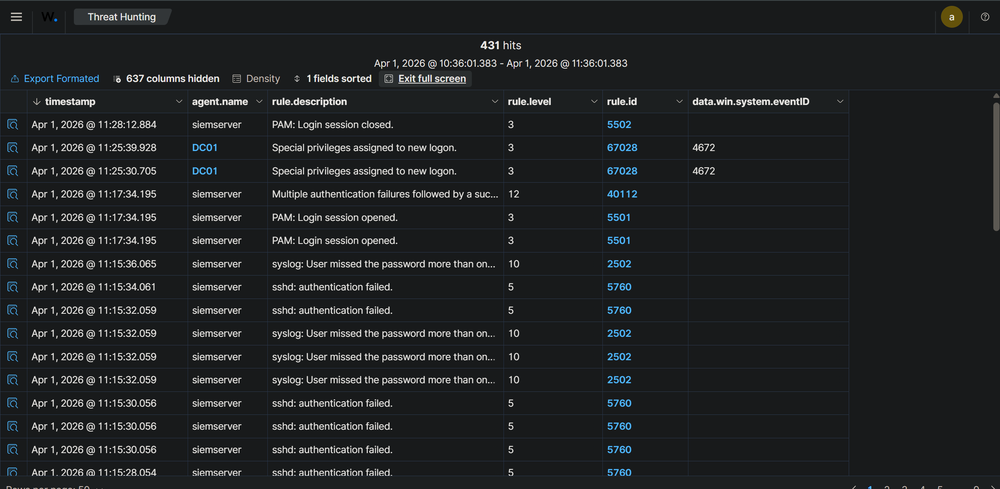
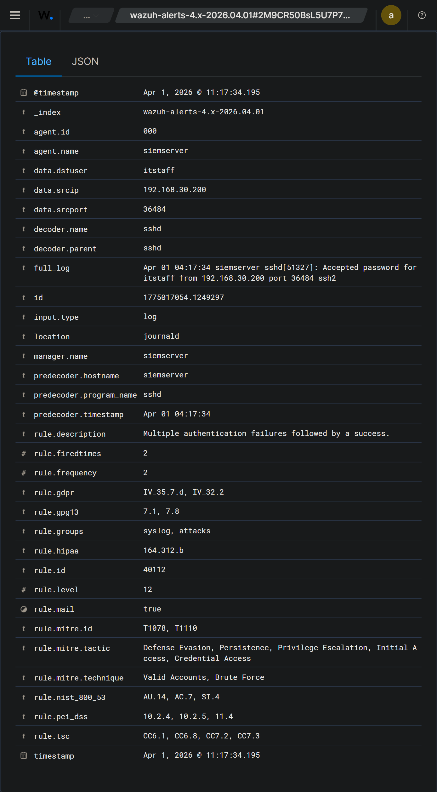

# 01 - Alert Triage

**Case:** INC-002-ssh-bruteforce  
**Investigator:** Hardhika Helmi  
**Started:** Apr 1, 2026 @ 11:15 (berdasarkan timestamp alert pertama)  
**Status:** Active

---

## Kenapa Case Ini Dibuka

Mulai dari Wazuh dashboard - ada cluster alert yang tidak biasa dari agent `siemserver`. Yang pertama nangkap perhatian adalah banyaknya rule 5760 (*sshd: authentication failed*) yang masuk dalam window waktu sangat singkat, semua dari satu source IP.

Awalnya tidak langsung jelas ini serangan atau bukan. Bisa saja user IT lupa password dan retry berkali-kali. Tapi volume-nya tidak wajar untuk skenario itu - terlalu banyak, terlalu cepat.

---

## Alert Awal yang Jadi Trigger

**Rule 5760 - sshd: authentication failed (cluster)**

*Alert list Wazuh - cluster 5760 authentication failed mulai 11:15, diikuti rule 40112 jam 11:17*

Dari cluster alert ini, beberapa hal yang saya perhatikan:

- Alert datang dari agent `siemserver` - ini SIEM server itu sendiri, bukan endpoint biasa
- Volume sangat tinggi dalam window waktu sempit (~2 menit)
- Semua failure sebelum ada satu success

Yang bikin ini lebih menarik: SIEM server harusnya bukan target yang bisa di-akses sembarangan dari dalam jaringan. Kalau ada yang sedang coba-coba masuk ke sini, ini perlu dilihat lebih serius.

---

## Triage Awal - Seberapa Serius?

Tiga pertanyaan yang saya kejar duluan:

**1. Ada logon SUCCESS setelah failures ini?**

Ya. Rule 40112 muncul jam 11:17:34 - *Multiple authentication failures followed by a success*. Ini yang langsung naikkan prioritas. Bukan hanya ada yang coba masuk, tapi mereka berhasil.

*Detail rule 40112 - data.srcip 192.168.30.200, data.dstuser itstaff, timestamp 11:17:34.195*

Dari detail alert ini, informasinya cukup lengkap:

- `data.srcip`: 192.168.30.200 - source IP konsisten satu alamat
- `data.dstuser`: itstaff - akun yang berhasil di-compromise
- `full_log`: `Accepted password for itstaff from 192.168.30.200 port 36484 ssh2`
- `rule.level`: 12 - high severity
- `rule.mitre.technique`: Brute Force, Valid Accounts

**2. itstaff akun sensitif?**

Belum bisa dipastikan di tahap ini. Yang saya tahu: akun ini ada di SIEM server. Perlu dicek privilege-nya - apakah standard user atau punya sudo.

**3. Ada aktivitas lanjutan setelah login berhasil?**

Rule 5501 (*PAM: Login session opened*) muncul bersamaan dengan 40112 di 11:17:34 - confirm ada sesi aktif. Rule 5502 (*PAM: Login session closed*) muncul jam 11:28:12 - sesi berlangsung sekitar 10 menit. Cukup untuk buka case.

---

## Alert Lain yang Muncul di Window Waktu yang Sama

Selain cluster SSH failures, ada beberapa alert lain yang muncul:

- **5710 - sshd: Attempt to login using non-existent user** - muncul berulang kali, artinya ada username yang dicoba tapi tidak exist di sistem. Ini konsisten dengan behaviour brute force yang pakai username wordlist - tidak semua username yang dicoba valid
- **5763 - sshd: brute force** - Wazuh sendiri sudah flag ini sebagai brute force pattern berdasarkan rate failures
- **2502 - syslog: User missed the password more than once** - corroboration dari syslog layer
- **67028 - Special privileges assigned to new logon** dari DC01 - ini tidak terkait, kemungkinan activity normal di DC01 yang terjadi di waktu bersamaan

---

## Initial Scope Assessment

Dari triage awal:

| Host | Status | Catatan |
|------|--------|---------|
| siemserver / 192.168.30.50 | **Compromised** | SSH brute force berhasil, akun itstaff login dari 192.168.30.200 |
| Kali / 192.168.30.200 | Attacker | Source dari semua failures dan successful login |
| DC01 / 192.168.30.100 | Tidak terdampak | Alert 67028 tidak terkait insiden ini |
| WKS01 / 192.168.30.101 | Tidak terdampak | Tidak ada indikasi |

**Hipotesis awal:**
Attacker dari 192.168.30.200 melakukan SSH brute force ke SIEM server (192.168.30.50), berhasil mendapatkan akses sebagai `itstaff`. Sesi berlangsung sekitar 10 menit (11:17 - 11:28). Belum diketahui apa yang dilakukan selama sesi tersebut.

**Yang paling mengkhawatirkan:** target adalah SIEM server sendiri. Kalau itstaff punya akses ke Wazuh atau log-log di dalamnya, attacker bisa tahu apa saja yang sudah terdeteksi.

**Langkah selanjutnya:** pivot ke 02-investigation.md - rekonstruksi aktivitas itstaff selama sesi 10 menit itu, cek privilege akun, lihat apa saja yang bisa diakses dari dalam SIEM server.

---

*Timeline kronologi lengkap ada di 03-timeline.md. Document ini fokus ke proses triage dan decision point awal.*
