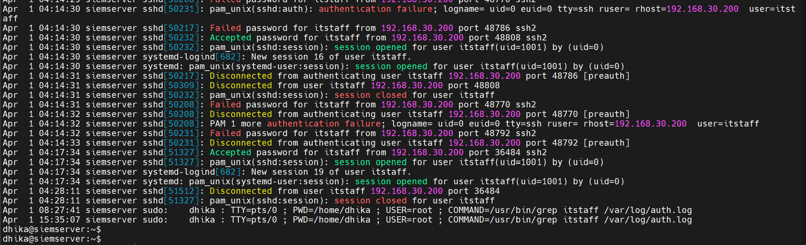
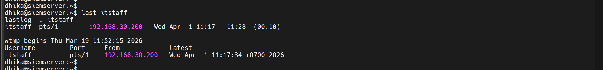
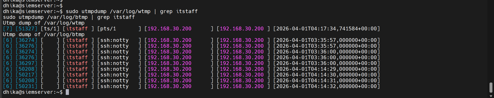

# 02 - Investigation

**Case:** INC-002-ssh-bruteforce  
**Investigator:** Hardhika Helmi  
**Status:** Active

---

## Starting Point

Dari triage: ada SSH brute force dari 192.168.30.200 ke siemserver, berhasil login sebagai `itstaff` jam 11:17:34 WIB. Sesi aktif sekitar 10 menit sampai 11:28:12 WIB. Wazuh tidak capture aktivitas apapun selama sesi berlangsung.

Pivot pertama: cari evidence di luar Wazuh. Login ke siemserver sebagai dhika, cek auth.log dan system logs secara langsung.

---

## Pivot ke auth.log

```bash
sudo grep "itstaff" /var/log/auth.log
```


*auth.log - semua event terkait itstaff, timestamp UTC*

> **Catatan timezone:** auth.log menggunakan UTC, Wazuh menggunakan UTC+7 (WIB). Selisih 7 jam. Contoh: `04:17:34 UTC` di auth.log = `11:17:34 WIB` di Wazuh - event yang sama.

Dari auth.log, ada temuan yang tidak terlihat di Wazuh sebelumnya - ada **dua** successful login untuk itstaff dari 192.168.30.200 dalam window waktu berdekatan:

**Login pertama - 04:14:30 UTC (11:14:30 WIB)**
```
Accepted password for itstaff from 192.168.30.200 port 48808 ssh2
session opened for user itstaff(uid=1001) by (uid=0)
session closed for user itstaff        ← langsung closed ~1 detik kemudian
```

**Login kedua - 04:17:34 UTC (11:17:34 WIB)**
```
Accepted password for itstaff from 192.168.30.200 port 36484 ssh2
session opened for user itstaff(uid=1001) by (uid=0)
...
Disconnected from user itstaff 192.168.30.200 port 36484  ← 04:28:11 UTC
session closed for user itstaff
```

Login pertama sesinya sangat singkat - dibuka lalu langsung tertutup dalam hitungan detik. Login kedua yang sesinya panjang (~10 menit) dan ini yang ter-capture di Wazuh sebagai alert 40112.

Kenapa ada dua login? Saya tidak bisa pastikan dari evidence yang ada. Kemungkinan ada proses otomatis yang establish connection sebelum login manual, tapi ini masih hipotesis.

---

## Cek last dan lastlog

```bash
last itstaff
lastlog -u itstaff
```


*last dan lastlog - record login session itstaff*

`last` hanya menampilkan satu sesi: `pts/1` dari 192.168.30.200, Wed Apr 1 04:17 - 04:28 (00:10). Login pertama (04:14:30) tidak muncul di sini - kemungkinan karena sesinya terlalu singkat dan tidak sempat terekam di wtmp secara penuh.

`lastlog` confirm: login terakhir itstaff dari 192.168.30.200 jam 04:17:34 UTC.

---

## Cek journalctl

```bash
sudo journalctl _UID=1001 --since "2026-04-01 11:15" --until "2026-04-01 11:30"
```


*journalctl UID=1001 - no entries*

Tidak ada entries. journalctl dengan filter UID=1001 tidak menemukan apapun untuk window waktu tersebut. Artinya aktivitas itstaff selama sesi tidak generate system journal entries yang ter-capture - command yang dijalankan tidak berinteraksi dengan systemd services atau tidak trigger logging di level journal.

Ini dead end dari sisi journald.

---

## Cek wtmp dan btmp

```bash
sudo utmpdump /var/log/wtmp | grep itstaff
sudo utmpdump /var/log/btmp | grep itstaff
```


*wtmp dan btmp - login records dan failed attempts*

**wtmp** (successful logins): satu entry - itstaff, pts/1, dari 192.168.30.200, timestamp 2026-04-01T04:17:34 UTC. Konsisten dengan yang ada di `last`.

**btmp** (failed attempts): banyak entry itstaff dari 192.168.30.200, dimulai dari 2026-04-01T03:35:57 UTC - jauh sebelum cluster failure yang pertama ter-capture Wazuh (11:15 WIB / 04:15 UTC). Artinya ada activity dari IP yang sama bahkan sebelum window yang saya monitor.

Ini temuan yang perlu dicatat: btmp menunjukkan failed attempts dari 192.168.30.200 mulai **03:35:57 UTC (10:35 WIB)** - sekitar 40 menit sebelum alert pertama muncul di Wazuh.

---

## Dead End - Aktivitas Selama Sesi Tidak Ter-capture

Dari semua pivot yang saya lakukan - auth.log, last, journalctl, wtmp/btmp - tidak ada satu pun yang bisa tunjukkan apa yang dilakukan selama sesi 10 menit itu. Yang saya tahu hanya:

- Login berhasil jam 04:17:34 UTC dari 192.168.30.200
- Sesi berjalan di pts/1
- Disconnect jam 04:28:11 UTC

Tidak ada command execution logging, tidak ada file access logging, tidak ada network activity logging untuk sesi ini. Aktivitas apa pun yang dilakukan selama 10 menit itu tidak meninggalkan jejak yang bisa saya baca dari sisi investigator.

Ini adalah gap yang significant - dibahas lebih lanjut di 05-detection-gaps.md.

---

## Rekonstruksi Lengkap

Dari semua evidence yang berhasil dikumpulkan:

1. Failed attempts itstaff dari 192.168.30.200 mulai **10:35 WIB** - tidak terdeteksi Wazuh (btmp)
2. Login berhasil pertama **11:14:30 WIB** - sesi sangat singkat, langsung closed (auth.log)
3. Cluster SSH failures masuk ke Wazuh mulai **11:15:28 WIB** (auth.log + Wazuh alert 5760)
4. Login berhasil kedua **11:17:34 WIB** - sesi aktif ~10 menit (Wazuh alert 40112, auth.log)
5. Disconnect **11:28:11 WIB** (auth.log, Wazuh alert 5502)
6. Aktivitas selama sesi: **tidak diketahui** - tidak ada logging yang capture

**Status akhir:** akun itstaff berhasil di-compromise. Attacker ada di dalam SIEM server selama ~10 menit. Apa yang dilakukan selama sesi tersebut tidak bisa direkonstruksi dari evidence yang tersedia.

---

## Yang Masih Belum Jelas

- Aktivitas spesifik selama sesi 10 menit itstaff
- Kenapa ada dua successful login dalam window berdekatan
- Failed attempts di btmp mulai 03:35:57 UTC - apakah ini sesi brute force terpisah sebelumnya
- Apakah itstaff pernah login legitimate sebelumnya untuk baseline comparison

---

*MITRE mapping detail ada di 04-mitre-mapping.md. Detection gaps dibahas di 05-detection-gaps.md.*
