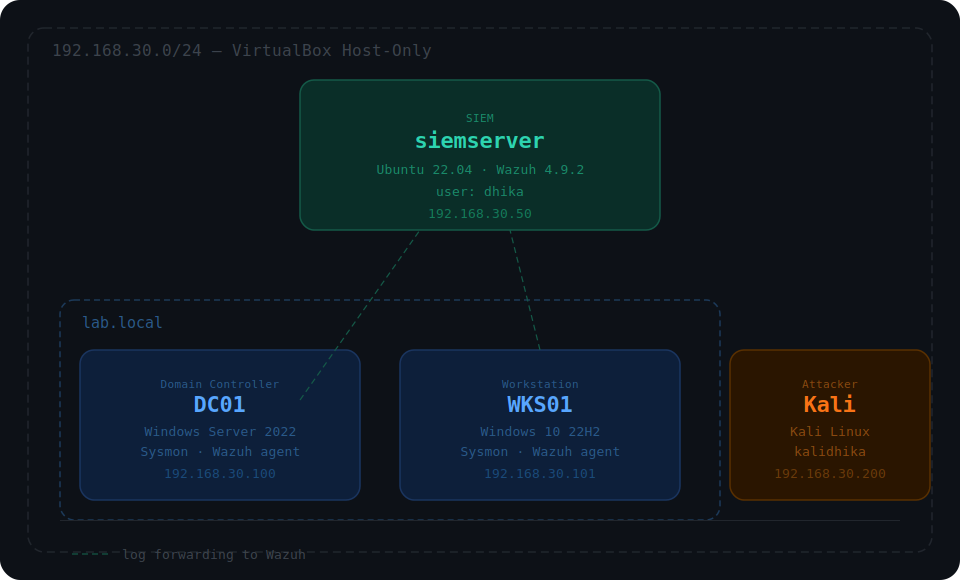

# Security Investigation Lab

Repo ini dokumentasi investigasi insiden yang saya jalankan di lab pribadi. Bukan tutorial maupun walkthrough, ini catatan kerja saya sebagai investigator yang trace aktivitas attacker dari alert sampai conclusion.

Setup lab: Windows AD environment (DC + workstation), Wazuh SIEM, attacker Kali Linux. saya generate aktivitas attacker, lalu melakukan investigasi dari sisi defender.

**Investigator:** Hardhika Helmi (DkHelmi)  
**Focus:** Network Forensics & Incident Response  
**Location:** Indonesia

---

## Cases

| Case | Scenario | Status |
|------|----------|--------|
| [INC-001-rdp-intrusion](./INC-001-rdp-intrusion/) | Password spray via SMB, lateral movement ke DC01 via WinRM, persistence via registry Run key | ✅ Completed |
| [INC-002-ssh-bruteforce](./INC-002-ssh-bruteforce/) | SSH brute force ke SIEM server, akun itstaff compromised, post-compromise discovery | ✅ Completed |

---

## Lab Environment

Dokumentasi lengkap lab base ada di [lab-base/](./lab-base/).

| Host | IP | OS | Role |
|------|----|----|------|
| SIEM | 192.168.30.50 | Ubuntu 22.04 | Wazuh 4.9.2 |
| DC01 | 192.168.30.100 | Windows Server 2022 | Domain Controller |
| WKS01 | 192.168.30.101 | Windows 10 22H2 | Workstation |
| Kali | 192.168.30.200 | Kali Linux | Attacker |

---

## Pendekatan

Setiap case berdiri sendiri dan tidak ada dependency antar case. Masing-masing punya lab snapshot sendiri sebagai starting point.

Investigasi selalu dimulai dari alert Wazuh, bukan dari tool atau teknik attacker. Attacker POV (tool output, terminal) disimpan di folder `attacker-logs/` per case sebagai referensi lab.

---

*Jika ada case baru akan di update segera.*
